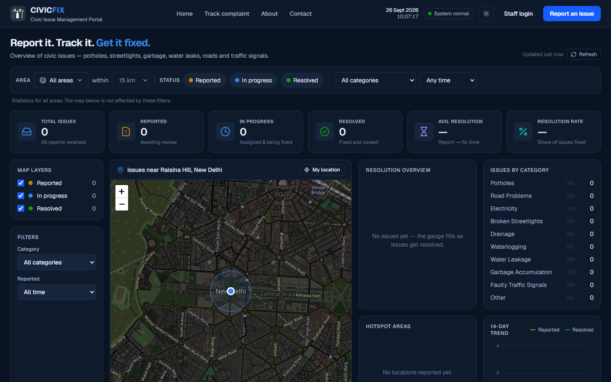
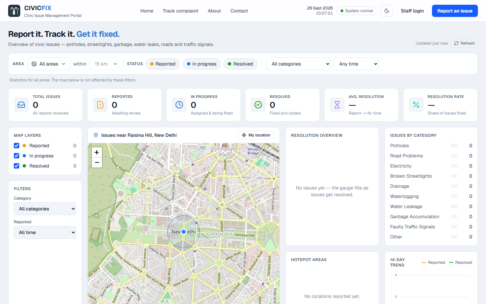
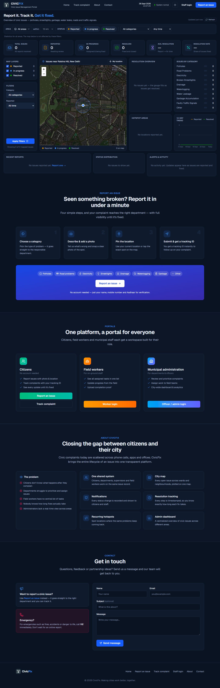
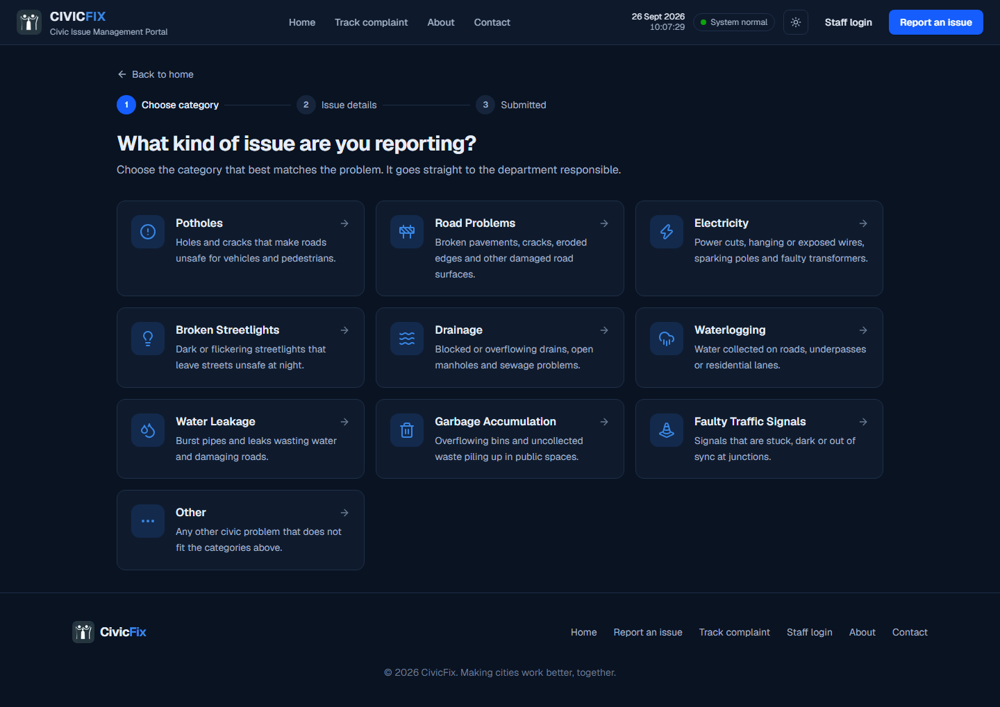
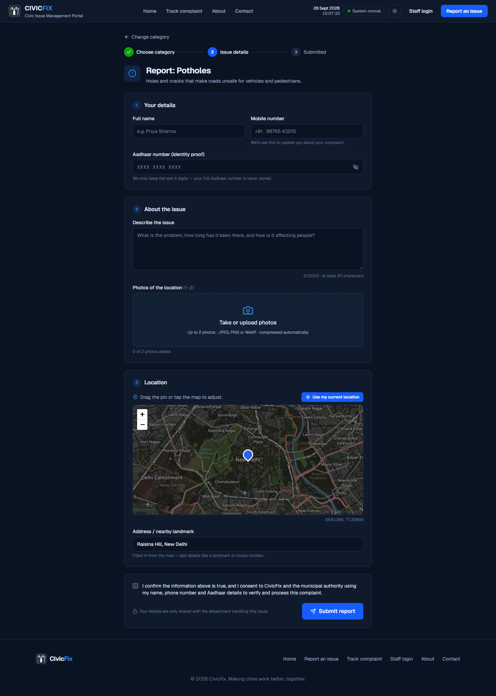
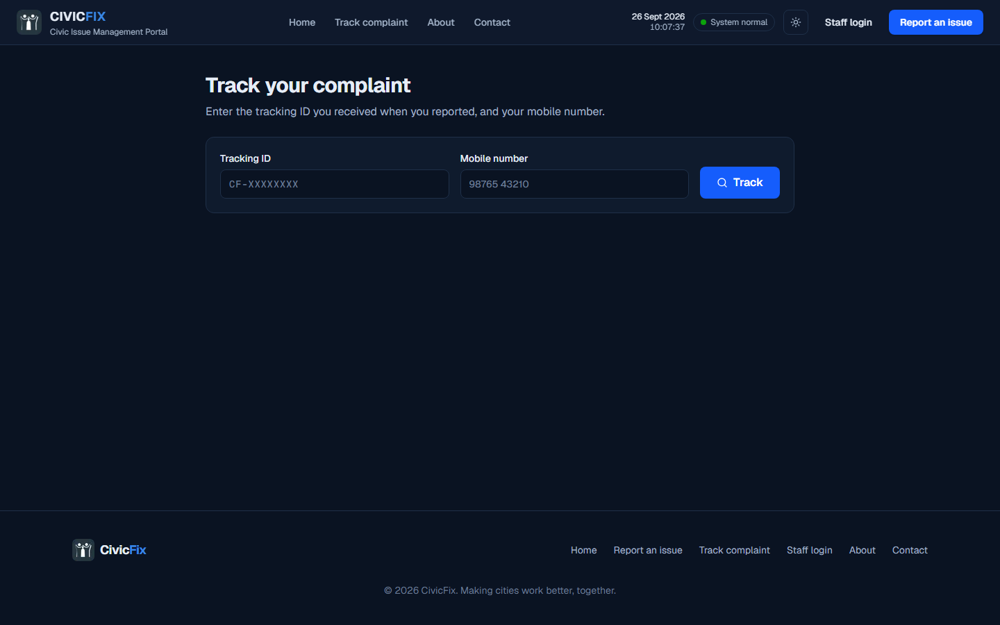
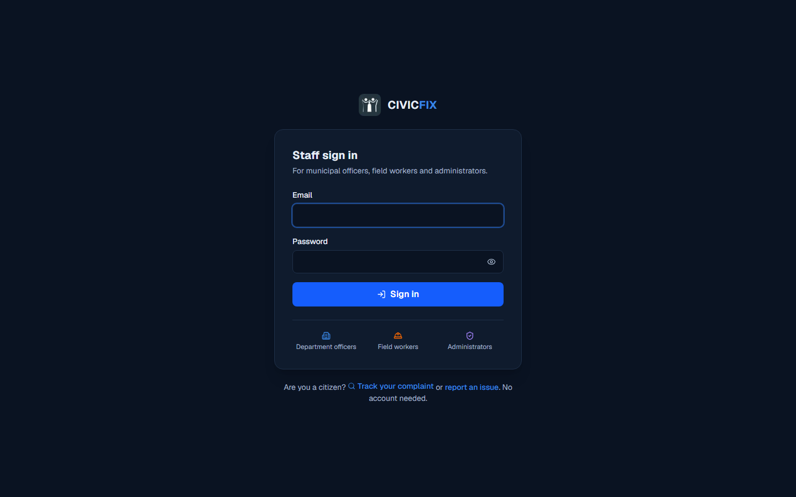

# CivicFix — Frontend

Web app for **CivicFix**, a civic issue platform connecting citizens, municipal departments, field workers and administrators.

Backend: [CivicFix-Backend](https://github.com/noobdivya/CivicFix-Backend)

## Screenshots

**Landing page: live dashboard and issue map** (dark and light themes)




<details>
<summary>Full landing page</summary>


</details>

**Report an issue**: choose a category, then add details, photos and a map pin

| Choose category | Issue details |
|---|---|
|  |  |

**Track a complaint** and **staff login**

| Track complaint | Staff login |
|---|---|
|  |  |

## Tech stack
- Next.js 16 (App Router), React 19, TypeScript, Tailwind CSS v4 (dark + light themes)
- Leaflet + OpenStreetMap tiles (no API key); lucide-react icons; hand-built SVG charts
- Plain REST: data loads when a page opens and when the user clicks Refresh (no real-time/background updates)

## Getting started

Prerequisites: [Node.js](https://nodejs.org/) 20+ and the [CivicFix backend](https://github.com/noobdivya/CivicFix-Backend) running on port 8080.

```bash
cp .env.example .env.local    # Windows PowerShell: copy .env.example .env.local
npm install
npm run dev                   # http://localhost:3000
```

| Variable | Default | Purpose |
|---|---|---|
| `NEXT_PUBLIC_API_URL` | `http://localhost:8080` in dev, same origin in production | Base URL the browser uses for the CivicFix API |
| `BACKEND_URL` | *(unset)* | Production only: `/api/*` and `/uploads/*` are forwarded here (see [next.config.ts](next.config.ts)) |

## Deployment (Vercel)

The backend runs on Render with a Neon database (see the [backend README](https://github.com/noobdivya/CivicFix-Backend#deployment-render--neon)). On Vercel, the browser calls `/api/...` on the frontend's own domain and Next.js forwards the request to the backend. This keeps the staff session cookie first-party, which a direct cross-site call from `vercel.app` to `onrender.com` would not.

1. In Vercel, choose *Add New → Project* and import this repository. The framework (Next.js) is detected automatically.
2. Add one environment variable: `BACKEND_URL` = your Render URL, e.g. `https://civicfix-api.onrender.com`. Do **not** set `NEXT_PUBLIC_API_URL`.
3. Deploy. Then set the backend's `CORS_ALLOWED_ORIGINS` to the Vercel URL.

## Pages

**Public / citizens** (no account)

| Route | Page |
|---|---|
| `/` | Landing page: map of all issues (centred on your location) and dashboard statistics with a **dashboard filter: area + radius (15 km default), status, category, time** — the filter changes the statistics only, not the map (area remembered per browser); report/track entry points, officials' messages, contact |
| `/report` → `/report/[category]` | Report an issue: choose category → details, **up to 2 photos**, map pin, Aadhaar → tracking ID |
| `/track` | Track a complaint with tracking ID + mobile number: progress, timeline, before/after photos |

**Staff** (sign in at `/login`)

| Route | Who | Page |
|---|---|---|
| `/department` · `/department/issues/[id]` | Department officers | Issue queue; review, prioritise, assign, reject, reopen, transfer, notes |
| `/worker` · `/worker/tasks/[id]` | Field workers | My tasks; start work, notes, resolve with completion photo, directions |
| `/admin` | Admins | City overview: department performance, recurring problem spots, resolution times, city map, field worker output |
| `/admin/issues` · `/admin/issues/[id]` | Admins | All issues across departments |
| `/admin/users` | Admins | Create staff accounts, change roles/departments, reset passwords, deactivate |

All staff pages have a notification bell (new complaints, assignments, progress, resolutions), loaded when the page opens or the bell is clicked.

## Scripts

| Command | Description |
|---|---|
| `npm run dev` | Start the dev server |
| `npm run build` | Production build |
| `npm run start` | Serve the production build |
| `npm run lint` | Lint |

## Project structure

```
src/app/                    routes (landing, report, track, login, department, worker, admin)
src/components/command/     header + landing dashboard
src/components/landing/     landing sections, public map
src/components/report/      report-an-issue flow
src/components/track/       complaint tracking
src/components/staff/       staff shell, issue queue & detail, actions, notifications
src/components/admin/       admin overview & staff management
src/components/ui/          badges, timeline, mini map
src/lib/                    API clients, auth context, validation, formatting, theme
```
